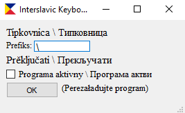

# English
## This is a simple program for better typing iun Interslavic languafe
## How to use it?

You should write any one-symbol prefix, for example: \ or any prefix
Then you should activate the program by click on checkbox below (if it isn't active) and press OK button 
Program will be closed, so you need to start it again
Now you can write interslavic symbols: c\ (your another prefiks) -> č

# Межславјанскы
## То є проста програма за лучше писанје в Межславјанском језику
## Како употребјати?

Нужно написати једнобыквенный префикс, напримѣр: \ или другы знак.
Потом треба активовати програму, кликнувши на полје ниже (ако не є активна), и натиснути кнопку OK.
Програма се затвори, тако что треба ју запустити снова.
Теперь можеш писати межславјанскы символы: c\ (или твој префикс) → č

# Русский
## Это простая программа для удобного ввода текста на межславянском языке
## Как пользоваться?

Введите однобуквенный префикс, например: \ или любой другой символ.
Затем активируйте программу, поставив галочку ниже (если не активна), и нажмите кнопку OK.
Программа закроется, поэтому нужно запустить её снова.
Теперь вы можете писать межславянские символы: c\ (или ваш префикс) → č

# Українська
## Це проста програма для зручного введення тексту міжславянською мовою
## Як користуватися?

Введіть односимвольний префікс, наприклад: \ або будь-який інший.
Далі активуйте програму, поставивши галочку нижче (якщо не активна), і натисніть кнопку OK.
Програма закриється, тому її потрібно запустити знову.
Тепер ви можете писати міжславянські символи: c\ (або ваш префікс) → č

# Беларуская
## Гэта простая праграма для зручнага ўводу тэксту на міжславянскай мове
## Як карыстацца?

Увядзіце аднабуквенны прэфікс, напрыклад: \ або іншы.
Потым актывуйце праграму, паставіўшы птушку ніжэй (калі не актыўна), і націсніце OK.
Праграма закрыецца, таму яе трэба запусціць зноў.
Цяпер вы можаце пісаць міжславянскія сімвалы: c\ (або ваш прэфікс) → č

# Polski
## To jest prosty program do wygodnego pisania w języku międzysłowiańskim
## Jak używać?

Wpisz jednoliterowy prefiks, na przykład: \ lub inny.
Następnie aktywuj program, zaznaczając pole poniżej (jeśli nie jest aktywny), i kliknij OK.
Program się zamknie, więc uruchom go ponownie.
Teraz możesz pisać znaki międzysłowiańskie: c\ (lub twój prefiks) → č

# Čeština
## Toto je jednoduchý program pro pohodlné psaní v mezislovanském jazyce
## Jak to používat?

Zadejte jednopísmenný prefix, například: \ nebo jiný.
Poté aktivujte program zaškrtnutím políčka (pokud není aktivní) a klikněte na OK.
Program se zavře, takže jej spusťte znovu.
Nyní můžete psát mezislovanské znaky: c\ (nebo váš prefix) → č

# Slovenčina
## Toto je jednoduchý program na pohodlné písanie v medzislovanskom jazyku
## Ako to používať?

Zadajte jednopísmenový prefix, napríklad: \ alebo iný.
Potom aktivujte program zaškrtnutím políčka (ak nie je aktívny) a kliknite na OK.
Program sa zavrie, takže ho spustite znova.
Teraz môžete písať medzislovanské znaky: c\ (alebo váš prefix) → č

# Slovenščina
## To je preprost program za enostavno pisanje v medslovanskem jeziku
## Kako uporabljati?

Vnesite enoznačni predpono, na primer: \ ali drugo.
Nato aktivirajte program z označitvijo polja spodaj (če ni aktiven) in kliknite OK.
Program se bo zaprl, zato ga ponovno zaženite.
Zdaj lahko pišete medslovanske znake: c\ (ali vaša predpona) → č

# Hrvatski
## Ovo je jednostavan program za lakše pisanje na međuslavenskom jeziku
## Kako koristiti?

Unesite jednobojni prefiks, na primjer: \ ili neki drugi.
Zatim aktivirajte program označavanjem kućice ispod (ako nije aktivan) i kliknite OK.
Program će se zatvoriti, pa ga morate ponovno pokrenuti.
Sada možete pisati međuslavenska slova: c\ (ili vaš prefiks) → č

# Српски / Srpski
## Ово је једноставан програм за лакше куцање на међусловенском језику
## Како користити?

Унесите једнобуквени префикс, на пример: \ или неки други.
Затим активирајте програм штиклирањем поља испод (ако није активан) и кликните OK.
Програм ће се затворити, па га поново покрените.
Сада можете писати међусловенска слова: c\ (или ваш префикс) → č

# Македонски
## Ова е едноставна програма за полесно пишување на меѓусловенски јазик
## Како да се користи?

Внесете еднобуквен префикс, на пример: \ или друг.
Потоа активирајте ја програмата со штиклирање подолу (ако не е активна) и кликнете OK.
Програмата ќе се затвори, па ќе треба да ја стартувате повторно.
Сега можете да пишувате меѓусловенски знаци: c\ (или вашиот префикс) → č

# Български
## Това е проста програма за по-лесно писане на междуславянски език
## Как да я използвате?

Въведете еднобуквен префикс, например: \ или друг.
След това активирайте програмата, като отбележите полето по-долу (ако не е активна) и натиснете бутона OK.
Програмата ще се затвори, така че трябва да я стартирате отново.
Сега можете да пишете междуславянски символи: c\ (или вашият префикс) → č

# Старословѣнскъ / Old Church Slavonic
## Се есть простъ програма въ помо́щь писанїѥ словѣньскыми писмены
## Кѣмо употреблѧти?

Пиши єдину знаку-предъставку, напримѣръ: \ или инаку.
Послѣ тѣмь дѣи програма, отметнꙋвъ по́лє нѝже (аще не єсть дѣѧща), и натисни на кнꙋпѫ OK.
Програма затворитьсѧ, и по томꙋ надобно єѧ второ́во запꙋстити.
Нынѣ можеши писати словѣньскыми знаки: c\ (или твоѧ предъставка) → č

# Hornjoserbšćina / Upper Sorbian
## To je jadnora program za lóše pisaće w medźusłowjanskim rěču
## Kak to wužiwać?

Zapodaj jednoliterowy prefiks, na přikład: \ abo druhi znak.
Potom zmóžń program pola zakliknjenja (jeli njeje aktiwny) a klikń na tłóčatko OK.
Program so začini, tohodla dyrbiš jón znowa startować.
Nětko móžeš pisać medźusłowjanske znamješka: c\ (abo twój prefiks) → č

# Esperanto
## Ĉi tiu estas simpla programo por pli facile tajpi en la interslava lingvo
## Kiel uzi ĝin?

Enigu unu-simbolan prefikson, ekzemple: \ aŭ alian.
Tiam aktivigu la programon markante la suban skatolon (se ĝi ne estas aktiva) kaj alklaku la butonon OK.
La programo fermos sin, do vi devos lanĉi ĝin denove.
Nun vi povas tajpi interslavajn simbolojn: c\ (aŭ via prefikso) → č
